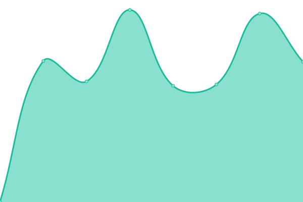

# [📈 Live Status](https://upptime.github.io/upptime): <!--live status--> **🟩 All systems operational**

This repository contains the open-source uptime monitor and status page for [Upptime](https://upptime.js.org), powered by [Upptime](https://github.com/upptime/upptime).

With [Upptime](https://upptime.js.org), you can get your own unlimited and free uptime monitor and status page, powered entirely by a GitHub repository. We use [Issues](https://github.com/upptime/upptime/issues) as incident reports, [Actions](https://github.com/buraste/upptime/actions) as uptime monitors, and [Pages](https://upptime.github.io/upptime) for the status page.

<!--start: status pages-->
<!-- This summary is generated by Upptime (https://github.com/upptime/upptime) -->
<!-- Do not edit this manually, your changes will be overwritten -->
<!-- prettier-ignore -->
| URL | Status | History | Response Time | Uptime |
| --- | ------ | ------- | ------------- | ------ |
|  [Hello Minaste](https://hellominaste.com) | 🟩 Up | [hello-minaste.yml](https://github.com/buraste/upptime/commits/HEAD/history/hello-minaste.yml) | 

 345ms
     
 | 

<a href="https://buraste.github.io/upptime/history/hello-minaste">100.00%</a>
    

|  [Hello Dükkan](https://dukkan.hellominaste.com) | 🟩 Up | [hello-duekkan.yml](https://github.com/buraste/upptime/commits/HEAD/history/hello-duekkan.yml) | 

 1087ms
     
 | 

<a href="https://buraste.github.io/upptime/history/hello-duekkan">100.00%</a>
    

|  [Bed & Beyond](https://bednbeyond.co) | 🟩 Up | [bed-and-beyond.yml](https://github.com/buraste/upptime/commits/HEAD/history/bed-and-beyond.yml) | 

 717ms
     
 | 

<a href="https://buraste.github.io/upptime/history/bed-and-beyond">100.00%</a>
    

|  [Seocly](https://seocly.com) | 🟩 Up | [seocly.yml](https://github.com/buraste/upptime/commits/HEAD/history/seocly.yml) | 

 361ms
     
 | 

<a href="https://buraste.github.io/upptime/history/seocly">100.00%</a>
    

|  [Octo House](https://octo.house) | 🟩 Up | [octo-house.yml](https://github.com/buraste/upptime/commits/HEAD/history/octo-house.yml) | 

 699ms
     
 | 

<a href="https://buraste.github.io/upptime/history/octo-house">100.00%</a>
    

<!--end: status pages-->

[**Visit our status website →**](https://upptime.github.io/upptime)

## 📄 License

- Powered by: [Upptime](https://github.com/upptime/upptime)
- Code: [MIT](./LICENSE) © [Upptime](https://upptime.js.org)
- Data in the `./history` directory: [Open Database License](https://opendatacommons.org/licenses/odbl/1-0/)
